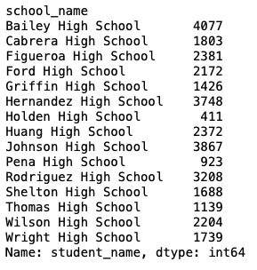

# School District Analysis
This analysis reevaluates standardized test data from a city school district after it is discovered that the score averages for ninth graders from Thomas High School are incorrect. It continues to consider these ninth graders in the analysis as students, but replaces their scores to provide new insights on school districts and their performance in standardized tests. The following analysis evaluates the effect of replacing the ninth graders' math and reading scores.

## Recreating and evaluating district and school summary dataframes:
* While average math and reading scores only decrease by small amounts (0.05% and 0.02%, respectively), the percentage of students passing each subject decreases by roughly 1% each. 

* For Thomas High School, 431 less students pass math, and 452 less students pass reading on the standardized tests by virtue of replacing the ninth graders' scores.

* Overall passing falls dramatically from 90.94% of Thomas High School students passing to 65.07%.

## Recalculating high and low performing schools:
* Replacing the ninth graders' math and reading scores removes Thomas High School from the list of top 5 high schools in the city district, however it does not cause the school to be considered among the lowest scoring schools.

## Recalculating impact on scores based on:
a) Grade – There are no changes in the data, except for replaced data for Thomas High School for 9th graders. Other than that column displaying 'NaN', there are no changes.

b) School Spending – By replacing the scores of the 9th graders, school spending is affected. We see a noticable shift in spending range per student that passes overall in the $630-644 range, which is the spending per student range that Thomas High School falls under.

c) School Size –

d) School Type –
